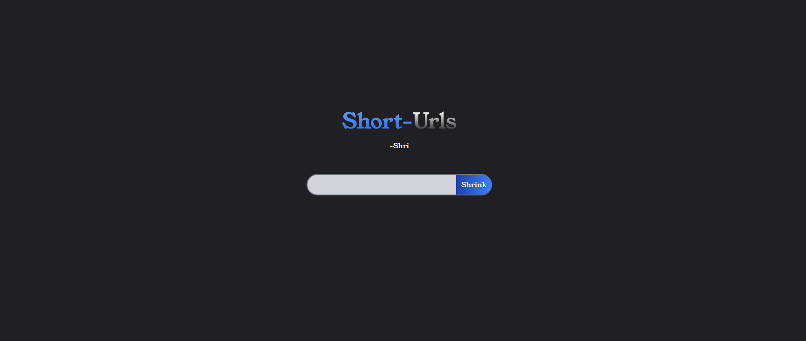

### This project is live at -- 

[Short Url (:](https://victorchiaka.github.io/short-url/)

# short-url
A url shortener with Tiny URL and react

#### Steps to get this on your machine

- Clone the repository

          git clone https://github.com/victorchiaka/short-url.git

- Move inside the directory

          cd short-url

- Install all necessary npm packages

          npm install

- Run tailwind

          npx tailwindcss -i src/input.css -o dist/output.css

     Append --watch at the end if you're on development else you don't to append

##### Finally

- Start the server

          npm start

     - And visit

               http://192.168.178.120:3000/short-url
          or

               http://localhost:3000/short-url

`Now you can shorten your URL right on your machine (:`
